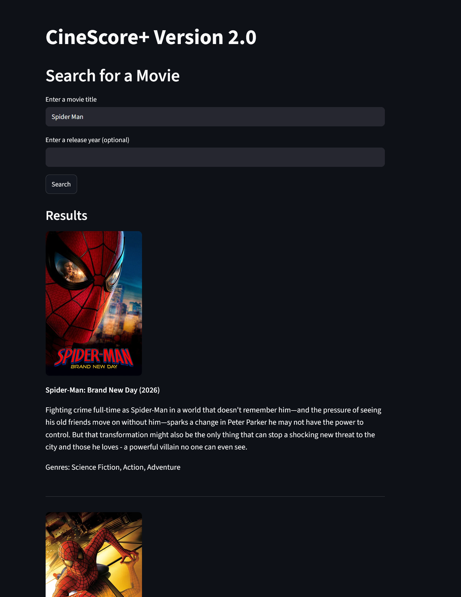
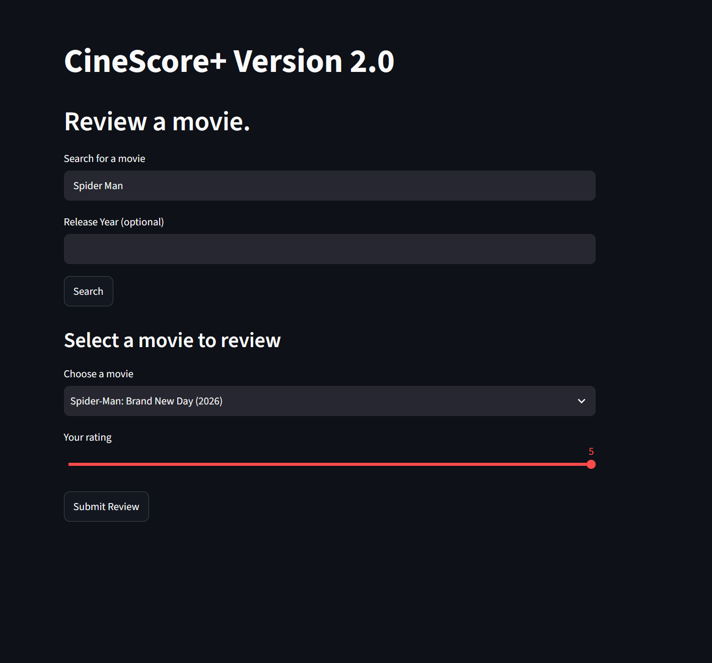
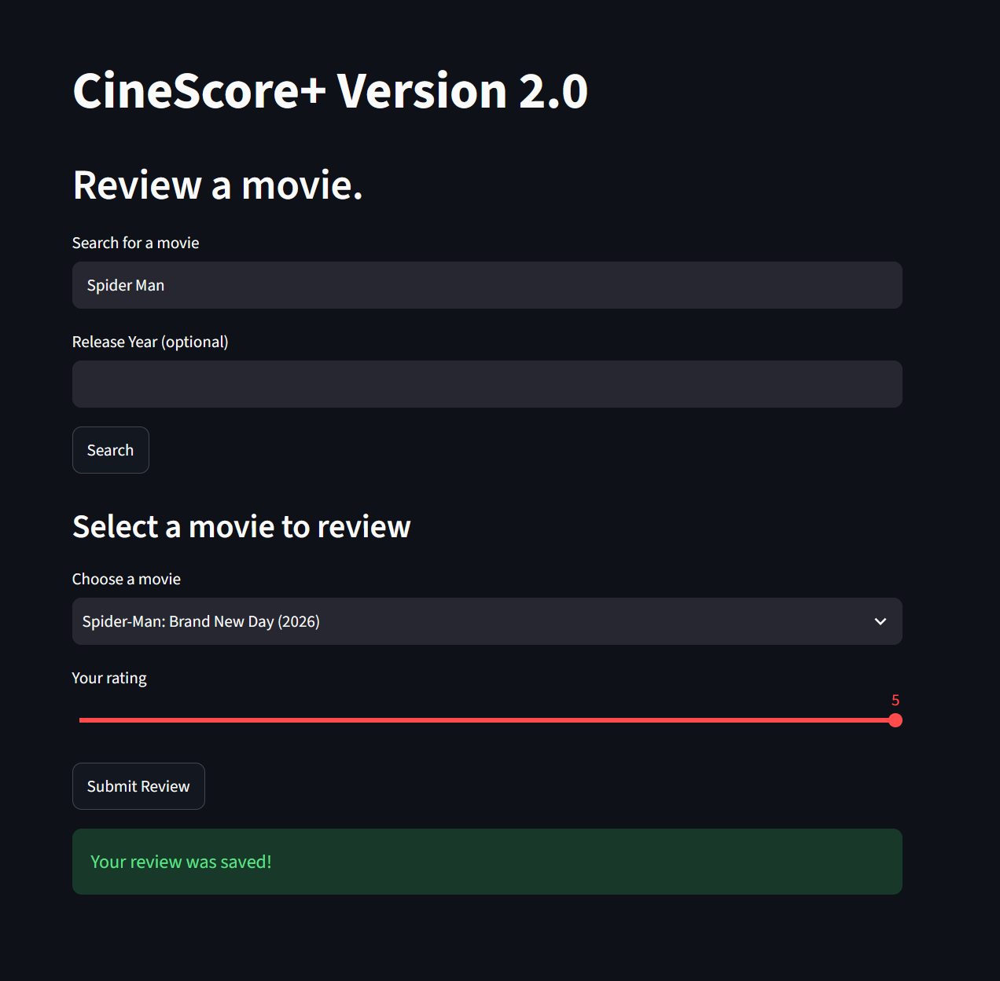
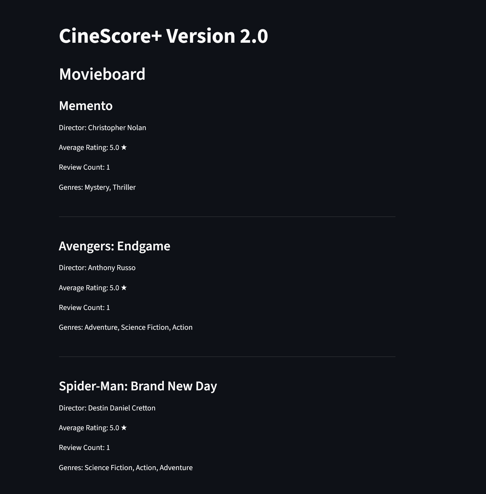
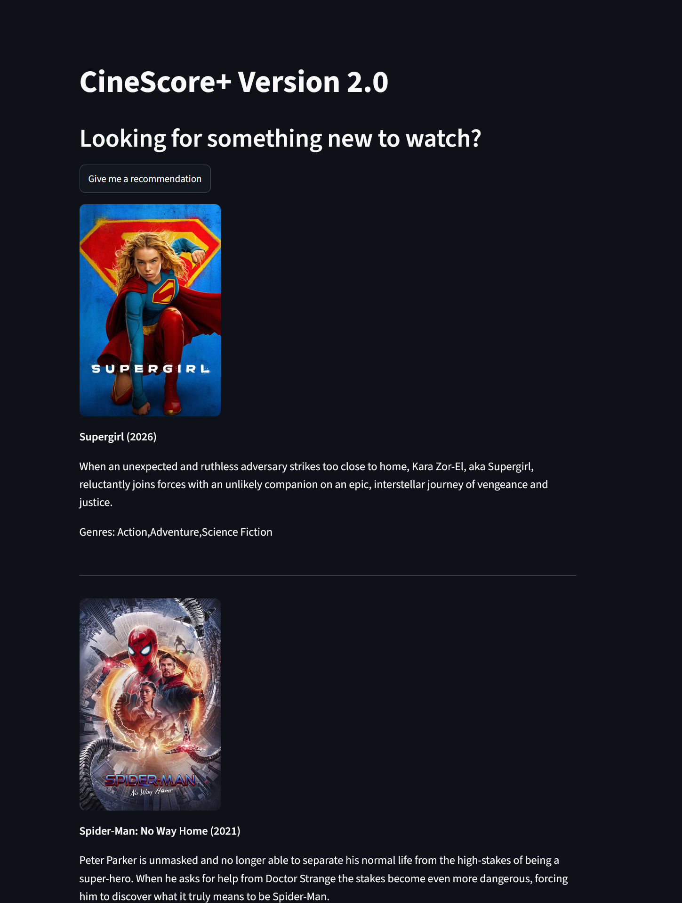

# CineScorePlus User Guide
HCI 5840 Project 2026

## Overview
CineScore+ is a simple and intuitive movie review app that lets users:

- Search for movies
- Submit ratings/reviews
- View a personalized Movieboard that shows top rated movies from review history
- Receive recommendations based on their highest rated genres

All movie data is sourced from The Movie Database (TMDB). The app is ran through the Streamlit Community Cloud.

## Accessing the App
Currently, the app is deployed on Streamlit Community Cloud. Click the button below to access it.

[**Open CineScore+**](https://cinescoreplus-l9jbfyytfv2ybkappfz4rmv.streamlit.app/)

## Navigation

CineScore+ uses a simple sidebar menu to switch between pages for each app function. You can navigate between pages using the dropdown on the left side of the screen.

**Pages:**
- Search Movies
- Submit Review
- Filter by Genre
- View Movieboard
- Recommendations

## Search Movies

Use this page to look up films using TMDB's movie database.

### How to Search

1. Type a movie title in to the search bar and a release year if you like.
2. Click **Search**
3. Your results will appear with a poster, the film title, release year, genre tags and a brief overview.

If no results appear, check spelling or using fewer search words.

## Filter by Genre

Use this page to browse movies by a specific genre.

### How to Filter
1. Enter a movie title into the search bar. Add a release year if needed.
2. Select a genre from the dropdown to filter the results by.
3. Results will be displayed within the selected genre.

Searching within a specific genre can help narrow down results better, or to look for a specific movie within a specific genre group.

## Submit Review

Leave a rating for movies you have seen.

## How to Submit a Review

1. Search for a movie, same as the Search instructions.
2. Select the movie from the dropdown you would like to review.
3. Choose a rating from 1-5 stars.
4. Click **Submit Review**
5. A confirmation message that your review has been saved will appear.

Your reviews will be used to rank entries on the Movieboard.

## Movieboard

The Movieboard shows all movies that have been reviewed, and ranks them by average rating.

**What you'll see in each entry:**

- Title
- Average rating
- Director 
- Genres 
- Release year
*(Posters will be added in future development)*

The Movieboard automatically updates as you add reviews.

## Recommendations

Get personalized recommendations based on your top-rated genres.

**How it Works**

- CineScore+ analyzes your review history
- Identifies your most reviewed genres
- Suggests movies you haven't reviewed yet that you may like
- Displays posters and basic info

Recommendations improve as you review more movies.

## Troubleshooting

**No search results displaying?**
- Check your spelling, TMDB can be picky.
- Try a shorter title
- TMDB may not have more obscure films logged

**Missing posters or metadata on your page?**
- TMDB may not have full information
- CineScore+ will show placeholders when needed

**App feels like it is running slow?**
- TMDB may be rate-limiting
- Wait a moment and retry

**Movieboard is empty**
- You may not have submitted any reviews yet.

## FAQ

**Do I need an account?**
No, there is no sign in necessary to use CineScore+.

**Where does the movie data come from?**
All data is provided by TMDB.

**Am I able to delete reviews?**
Currently, not in the current version. This may be added in future development.

**Why are some movies missing posters?**
TMDB may not have an image available in the database.

